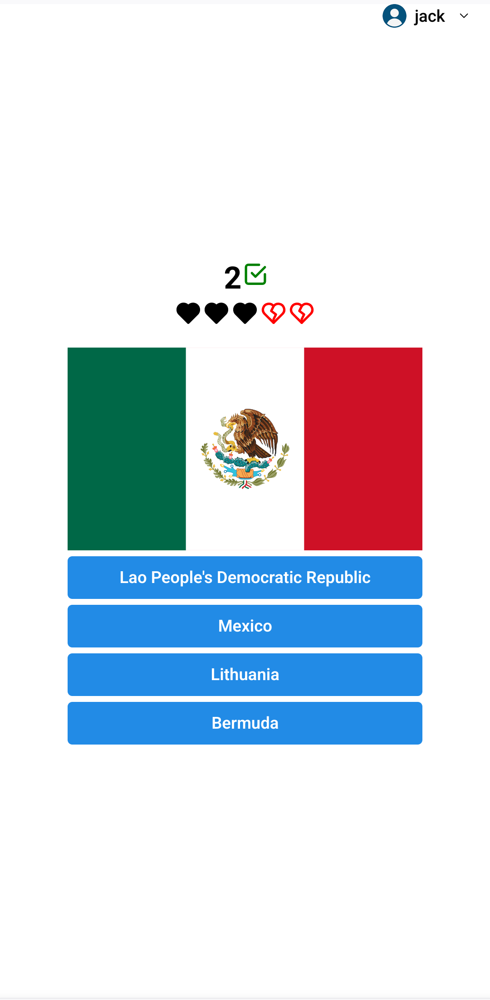
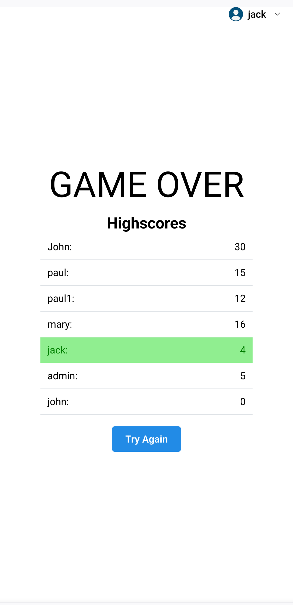

# Flag guessing app
This game displays random flags and the user has to guess which country it belongs to.
Built with [ReactJS](https://react.dev/) + [Mantine](https://mantine.dev/). Flags sourced from [react-world-flags](https://smucode.github.io/react-world-flags/). The API server runs in [NodeJS](nodejs.org), and there's an alternative API code in PHP [here](https://github.com/leandrorsant/flag-guessing-app-php-server).

# Get started
Clone this repository and install dependencies
```
git clone https://github.com/leandrorsant/flag_guessing_app
cd flag_guessing_app
npm i

cd server
npm i
```

# Start client and server
```
npm start
npm run devStart
```


## Screenshots:


</div>